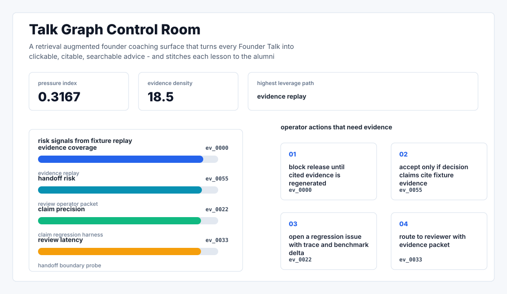
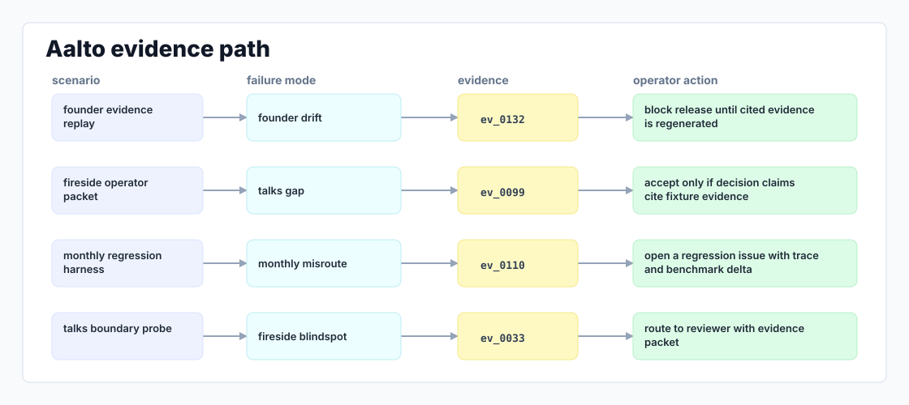

# Talk Graph

A retrieval augmented founder coaching surface that turns every Founder Talk into clickable, citable, searchable advice - and stitches each lesson to the alumni companies it influenced.



## Why it exists

Founder Talks is a monthly fireside chat that produces ~60 minutes of dense, unindexed video per event.

Most internal demos stop at a pretty chart. This repository is built around the harder part: a repeatable path from fixture, to failure, to evidence, to the operator action a serious team would actually trust.

## What is inside

- A deterministic replay harness tuned around founder, talks, and monthly.
- Company-specific strategy code in `src/talk_graph/strategy.py`, not just README-level customization.
- Citation-locked reports where every decision claim has to point back to a generated evidence ID.
- Two visual artifacts generated from the latest run: `outputs/project_working.svg` and `outputs/evidence_map.svg`.
- A portable demo pack with JSON, CSV, Markdown, HTML, SVG, and benchmark artifacts.



## Signals it measures

- `founder coverage`
- `talks risk`
- `monthly precision`
- `fireside latency`

## Failure modes it plants

- founder drift
- talks gap
- monthly misroute
- fireside blindspot

## Run it locally

```bash
uv sync
uv run talk-graph all
uv run pytest -q
uv run ruff check .
```

## Outputs worth opening

- `outputs/dashboard.html`
- `outputs/project_working.svg`
- `outputs/evidence_map.svg`
- `outputs/operator_brief.md`
- `outputs/decision_report.md`
- `outputs/strategy_model.json`
- `outputs/demo_pack.zip`

## Boundary

Everything runs locally against synthetic fixtures. There are no credentials, no customer records, no outreach files, and no hosted API dependency.
